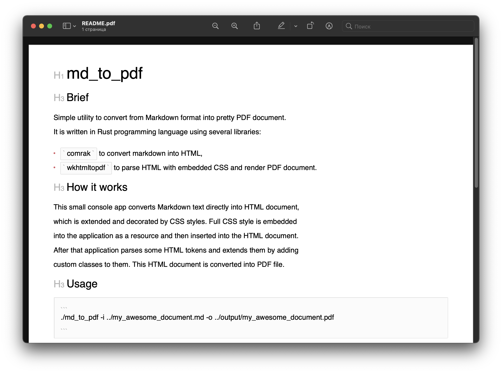

# md_to_pdf

## Example
Current Markdown document (this README.md) is converted into the following PDF:


---

## Brief
Simple utility to convert from Markdown format into pretty PDF document. 
It is written in Rust programming language using several libraries:
- `comrak` to convert markdown into HTML,
- `wkhtmltopdf` to parse HTML with embedded CSS and render PDF document.

## How it works
This small console app converts Markdown text directly into HTML document,
which is extended and decorated by CSS styles. Full CSS style is embedded
into the application as a resource and then inserted into the HTML document.
After that application parses some HTML tokens and extends them by adding
custom classes to them. This HTML document is converted into PDF file.

## Installing

Depends on [wkhtmltopdf][1], after installing this dependency run:
```
cargo install --git https://github.com/GeorgyFirsov/md_to_pdf.git
```

### Linux and MacOS

[wkhtmltopdf][1] can be downloaded and installed with a package manager as such as apt, pacman or Homebrew. 

### Windows
A windows installer for [wkhtmltopdf][1] is available from the downloads page. Note that you may need to configure your environment in such a way that your linker can find the .DLL and .LIB files in their installation directory.


## Usage
```shell
./md_to_pdf ../my_awesome_document.md --pdf ../my_awesome_document.pdf
```

## Feature Flags

 - `--no-annotate-headings` - disable the H1, H2 etc annotations before headings in the output.
 - `--no-annotate-external-links` - disable the  chain icon added to links in the output.
 - `--frontmatter-delimiter="---"` - strip frontmatter from the markdown before processing.

## Custom templates and styles

see [example.sh](./example_template/example.sh)

- `--master-template="example_template/document.html.hbs"` override the default master template with a custom one (enables custo cover pages)
- `--additional-stylesheets="example_template/styles.css"` add to the base stylesheet with one or more additional stylesheets.

## Using another HTML->PDF engine

[wkhtmltopdf is marked as deprecated][2], in the case of report generation or where HTML input can be trusted, they recommend using an alternative such as weasyprint, prince, etc.

For this reason you can omit the --pdf option which will stop the program generating a PDF file, and instead use the --html option, which will output the generated HTML.

```shell
md_to_pdf --html out.html README.md
weasyprint .\out.html out.pdf
```

[1]: https://wkhtmltopdf.org/downloads.html
[2]: https://wkhtmltopdf.org/status.html
